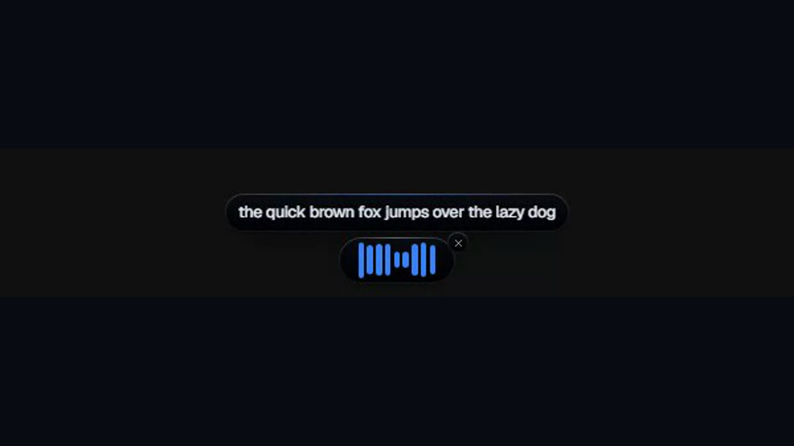
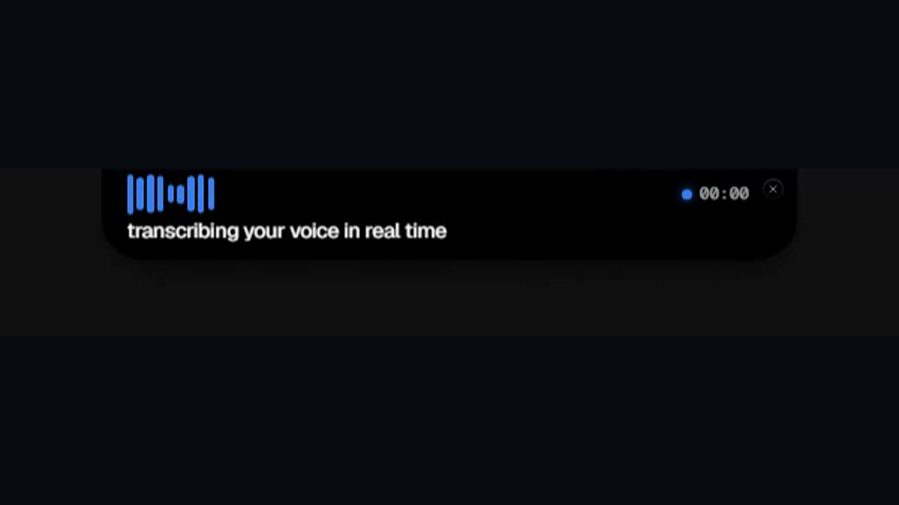
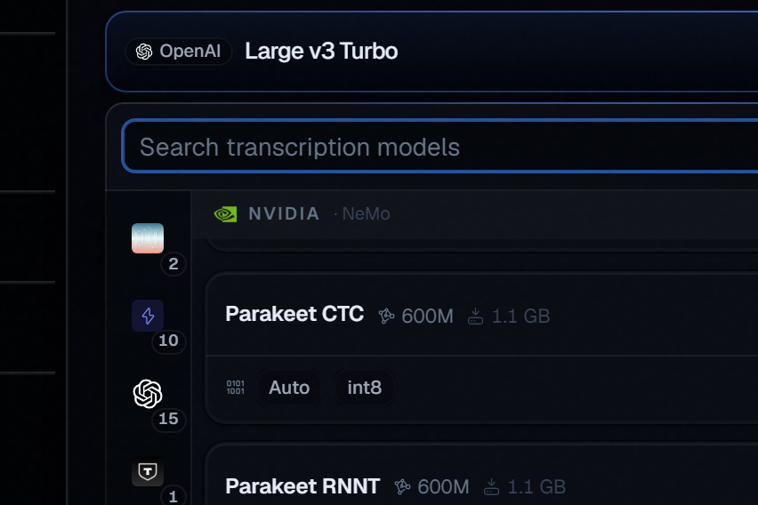
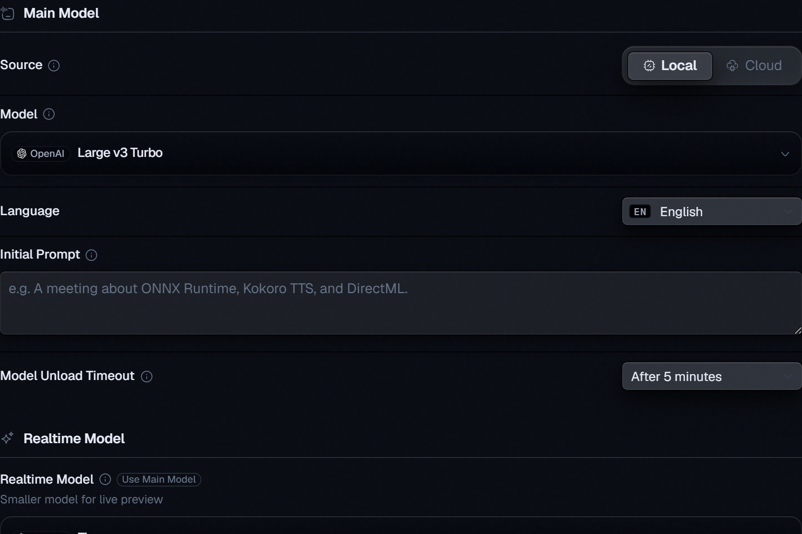
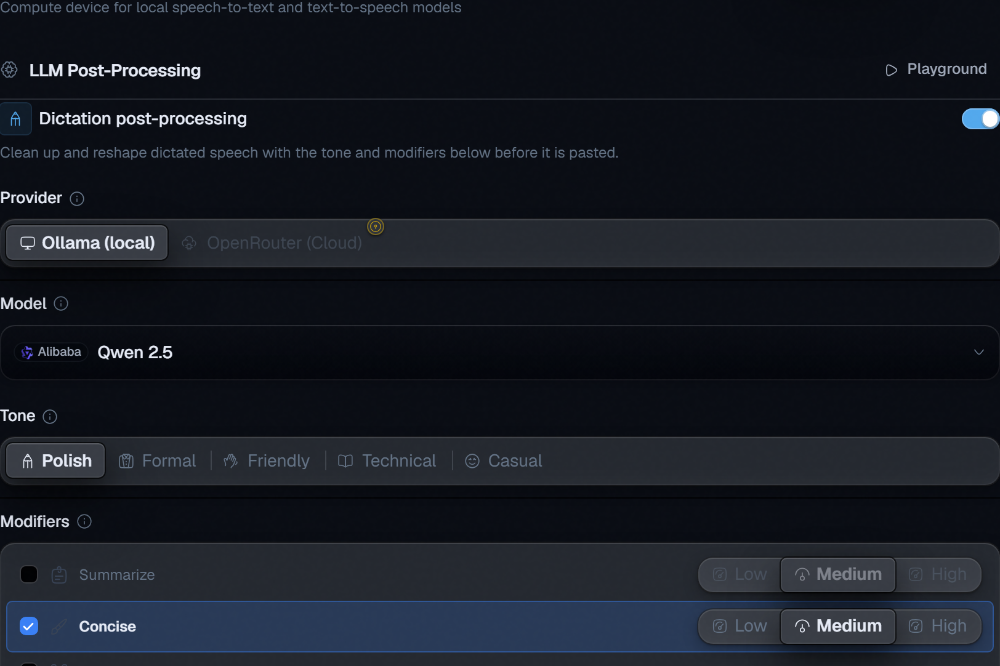

# WinSTT

WinSTT is a local-first speech-to-text desktop app for macOS, Linux, and
Windows. Press a hotkey, speak, and the transcription lands at your cursor in
any app. It also includes real-time preview, file transcription, dictionary
corrections, snippets, transcription history, optional LLM cleanup, and
text-to-speech.

**Docs:** [winstt.github.io/WinSTT](https://winstt.github.io/WinSTT/) ·
**Latest alpha:** [GitHub Releases](https://github.com/dahshury/WinSTT/releases/latest)

<p align="center">
  
</p>

## What It Looks Like

The recording overlay can sit at the bottom of the screen or dock at the top as
a dynamic island. Both previews below use the same 16:9 canvas so the README
does not jump between short and tall media.

<table>
  <tr>
    <td width="50%">
      
      <br>
      <strong>Floating bottom</strong>
    </td>
    <td width="50%">
      
      <br>
      <strong>Dynamic island</strong>
    </td>
  </tr>
</table>

<table>
  <tr>
    <td width="33%">
      
      <br>
      <strong>Model picker</strong>
    </td>
    <td width="33%">
      
      <br>
      <strong>Speech-to-text</strong>
    </td>
    <td width="33%">
      
      <br>
      <strong>LLM cleanup</strong>
    </td>
  </tr>
</table>

## Features

- Four recording modes: push-to-talk, toggle, listen, and wake word.
- On-device STT through ONNX Runtime via `ort`, with CPU fallback and
  platform accelerators where available.
- 70+ model catalog covering Whisper, NeMo, Moonshine, GigaAM, Kaldi, and more.
- Real-time preview with a fast model while the main model produces the final
  text.
- Optional LLM cleanup through local Ollama or opt-in cloud providers.
- Text-to-speech, dictionary corrections, snippets, and searchable history.

## Develop

The project builds on macOS, Linux, and Windows. Local Windows development needs
the Visual Studio build tools, [Bun](https://bun.sh), and the Rust toolchain.
Use the helper scripts in `tools/windows/`; they set up the VS environment and
run from the repository root.

```powershell
# Dev server with hot-reload renderer + Rust backend
tools\windows\tauri-dev.ps1

# Release build without bundling an installer
tools\windows\tauri-build.bat

# Rust-only checks from src-tauri/
tools\windows\cargo-env.bat check
```

`cargo build --release` is not enough for a standalone app because Tauri still
loads the dev URL. Use `bun run tauri build --no-bundle` through the helper for a
standalone executable.

## Documentation

The public documentation site is
[https://winstt.github.io/WinSTT/](https://winstt.github.io/WinSTT/). The
TanStack Start + Fumadocs source lives in [`docs/`](docs/) and deploys to GitHub
Pages through [`.github/workflows/pages.yml`](.github/workflows/pages.yml).

```powershell
bun run docs:dev
bun run docs:build
bun run docs:build:pages
```

## Structure

| Path | Purpose |
| --- | --- |
| `src/` | Tauri renderer (React, Feature-Sliced Design) |
| `src-tauri/` | Rust backend: `winstt::*` modules, STT engines, audio, settings, IPC |
| `docs/` | TanStack Start docs site and documentation assets |
| `public/`, `windows/`, `messages/` | Static assets, secondary windows, and i18n messages |
| `packages/` | Shared renderer packages, including the model picker |
| `tools/` | Developer tooling: platform build helpers, i18n checks, benchmark helpers, and asset generation |

## License

MIT. See [`LICENSE`](LICENSE) and
[`THIRD_PARTY_NOTICES.md`](THIRD_PARTY_NOTICES.md).
