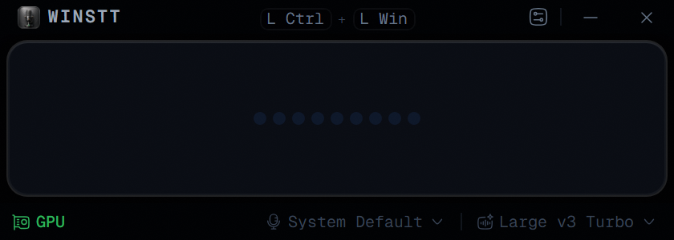
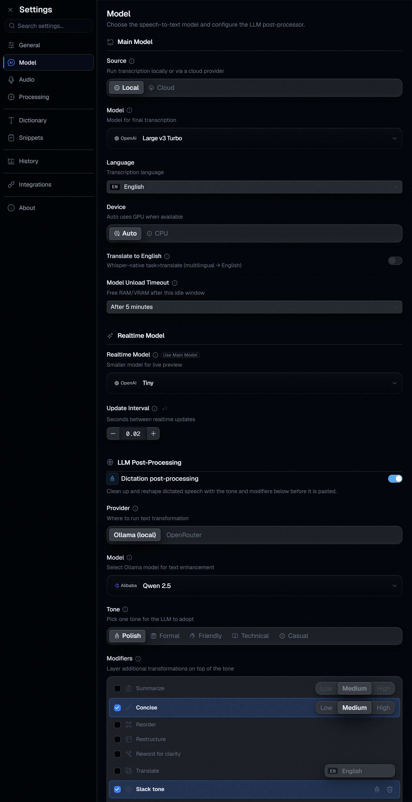
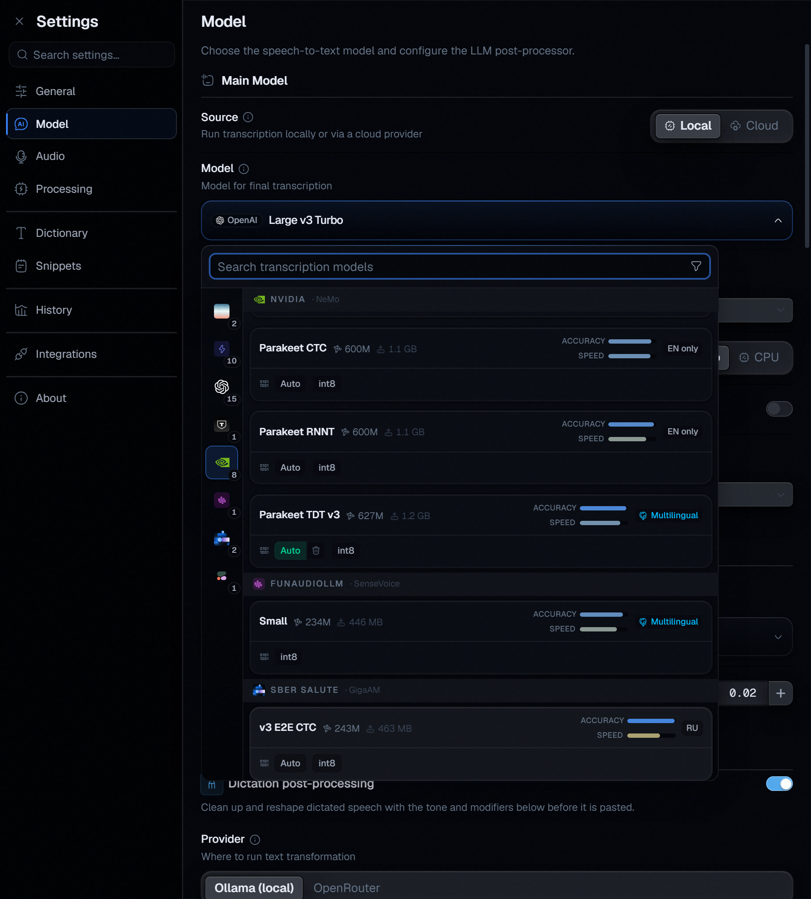
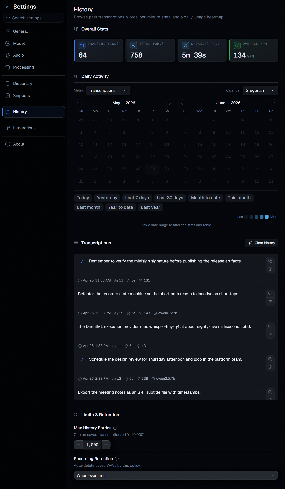
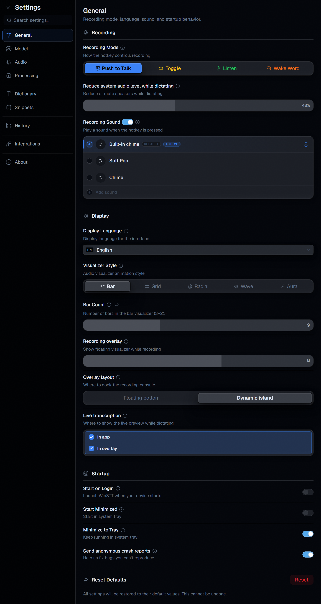
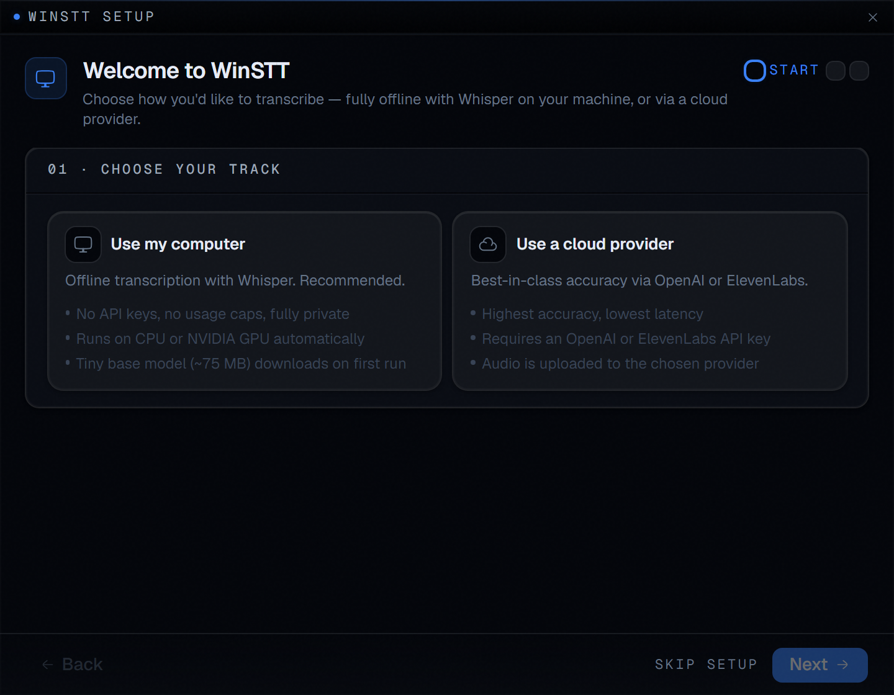

<p align="center">
  
</p>

<h1 align="center">WinSTT</h1>

<p align="center">
  <strong>Local-first speech-to-text for Windows.</strong><br>
  Press a hotkey, speak, and the transcription is pasted straight into whatever app you're using — entirely on your machine.
</p>

<p align="center">
  <a href="https://github.com/winstt/WinSTT/releases"></a>
  
  <a href="LICENSE"></a>
  
  <a href="https://winstt.app/docs"></a>
</p>

<p align="center">
  <a href="https://winstt.app/docs/quick-start">Quick start</a> ·
  <a href="https://winstt.app/docs/install">Download</a> ·
  <a href="https://winstt.app/docs">Documentation</a> ·
  <a href="https://github.com/winstt/WinSTT/discussions">Discussions</a>
</p>

---

WinSTT pairs a Python STT server with an Electron frontend. **All transcription runs locally** — audio is processed in memory by on-device ONNX models and never leaves your machine. There are no usage analytics. Optional LLM cleanup runs locally via Ollama or, opt-in, OpenRouter. Anonymized crash reports (Sentry) are on by default and can be disabled in settings.

## How it works

1. **Press** a configurable hotkey — push-to-talk, toggle, passive loopback, or wake word.
2. **Speak.** A live transcription preview appears as you go.
3. **Stop** — release the hotkey, press it again, or just stop talking (voice-activity detection ends the turn).
4. **Get** the polished transcription pasted directly into whichever app you were typing into.

The pipeline is entirely local: PortAudio → WebRTC + Silero VAD → ONNX Runtime (Whisper / NeMo / Moonshine / Cohere / GigaAM / Vosk / T-One) → optional Ollama / OpenRouter / Apple Intelligence cleanup → clipboard paste.

## Why WinSTT

- **Local-first by design** — audio is processed in-memory and discarded; the only outbound signal is opt-out crash reports.
- **40+ models, one engine** — Whisper, Lite-Whisper, NVIDIA NeMo (Parakeet/Canary), Moonshine, Cohere, GigaAM, Vosk/Kaldi, T-One. All ONNX, all swappable from the UI without a restart.
- **No PyTorch in the hot path** — the transcription stack is ONNX-only. Torch is pulled in only by the optional Smart Endpoint extra.
- **Three installers, no Python required** — the bundled `stt-server.exe` is a PyInstaller artifact. End users install nothing else.
- **Open source** — every line is auditable. MIT licensed.

## Features

|  |  |
|---|---|
| **Real-time transcription** — live preview (fast model) plus an accurate final pass (main model) | **Four recording modes** — push-to-talk, toggle, **listen** (passive loopback), and **wake word** (Porcupine / openWakeWord) |
| **LLM text enhancement** — tone presets, custom modifiers, and hotkey transforms via Ollama, OpenRouter, or Apple Intelligence | **Text-to-speech** — read selected text aloud with Kokoro-82M (54 voices, 9 languages) |
| **File transcription** — drop audio files, export plain text or SRT subtitles | **Dictionary & snippets** — fuzzy term correction and trigger-based text expansion |
| **Transcription history** — a local dashboard with word stats, an activity heatmap, search, and karaoke playback | **Localized UI** — English, Spanish, French, Chinese, Hindi, Arabic |

## Screenshots

<table>
  <tr>
    <td width="50%"><br><sub><b>Model settings</b> — 40+ models, quantization, device, realtime preview.</sub></td>
    <td width="50%"><br><sub><b>Model picker</b> — grouped by maker with accuracy/speed bars and per-quant download.</sub></td>
  </tr>
  <tr>
    <td width="50%"><br><sub><b>History</b> — stats, activity heatmap, searchable log, playback.</sub></td>
    <td width="50%"><br><sub><b>General</b> — recording modes, visualizer, overlay, startup.</sub></td>
  </tr>
  <tr>
    <td width="50%"><br><sub><b>Onboarding</b> — a guided first run: local or cloud, mic test.</sub></td>
    <td width="50%"><br><sub><b>Overlay</b> — live transcription in a floating pill or dynamic island.</sub></td>
  </tr>
</table>

## Download

Each release publishes three portable installers on the [Releases](https://github.com/winstt/WinSTT/releases) page. All three wrap the same Electron app and a bundled `stt-server.exe` — no Python or extra setup required.

| Installer | Size | Use when |
|-----------|------|----------|
| `WinSTT-Portable-<version>.exe` | ~200 MB | **Default GPU build.** Any D3D12-capable GPU (AMD / Intel / NVIDIA). Bundles `onnxruntime-directml`. Falls back to CPU automatically. |
| `WinSTT-CPU-Portable-<version>.exe` | ~150 MB | No GPU, or you want the smallest download. CPU-only ORT. |
| `WinSTT-OpenVINO-Portable-<version>.exe` | ~250 MB | Intel ARC dGPU or recent Iris Xe / Arc iGPU. ~10–30 % faster than DirectML on Intel silicon. |

> No CUDA installer ships on Windows — DirectML is faster and ~10× lighter than CUDA on our workload (whisper-tiny-q4: DirectML p50 **85 ms** vs CUDA p50 **120 ms** on an RTX 3080 Ti). The `[gpu]` extra exists for the future Linux NVIDIA build only.

New here? The two-minute [Quick Start](https://winstt.app/docs/quick-start) walks you from download to your first dictation.

---

## Development

The sections below are for **development** only — end users just download an installer above.

### Prerequisites

| Tool | Purpose |
|------|---------|
| [Git](https://git-scm.com/) | Clone the repo and the `onnx-asr` dependency |
| [uv](https://docs.astral.sh/uv/) | Python package manager — installs Python and server deps |
| [Bun](https://bun.sh/) | JavaScript runtime — installs frontend deps |
| D3D12-capable GPU | Optional — enables DirectML inference (recommended default) |
| Intel ARC / Iris Xe | Optional — enables OpenVINO inference |
| [Ollama](https://ollama.com) | Optional — local LLM cleanup / custom transforms |

> The transcription stack is **ONNX-only**. There is no PyTorch or faster-whisper dependency in the hot path — PyTorch is pulled in *only* for the optional `sentence-classifier` extra (Smart Endpoint).

### Quick setup (one-click)

```bat
setup-dev.bat
```

Installs uv (if missing), Python 3.11, and all server + frontend deps. Picks the DirectML flavor by default; override with `setup-dev.bat --flavor cpu`, `--flavor openvino`, or `--flavor gpu` (NVIDIA / Linux only).

### Manual setup

```bash
# 1. Install uv
irm https://astral.sh/uv/install.ps1 | iex   # PowerShell

# 2. Server deps — pick one runtime extra (onnx-asr is fetched from a pinned commit)
cd server
uv sync --extra cpu          # CPU-only ONNX Runtime (smallest)
uv sync --extra directml     # AMD / Intel / NVIDIA via DirectX 12 (recommended)
uv sync --extra openvino     # Intel ARC dGPU or recent Iris Xe / Arc iGPU
# optional: --extra tts (Kokoro TTS), --extra sentence-classifier (Smart Endpoint, pulls PyTorch)

# 3. Frontend deps
cd ../frontend
bun install
```

### Running

```bash
# Terminal 1 — STT server
cd server
uv run stt-server            # add -m tiny.en for a smaller/faster model, --help for all flags

# Terminal 2 — Electron app
cd frontend
bun electron:dev             # connects over dual WebSocket channels (control 8011, audio 8012)
```

### Docs site

```bash
cd docs
bun install
bun dev                      # http://localhost:3000
```

## Project structure

```
WinSTT/
├── server/          Python STT + TTS engine (hexagonal architecture)
├── frontend/        Electron + Vite multi-page React 19 desktop app (FSD architecture)
│   └── packages/    Internal packages (e.g. model-picker)
├── packaging/       electron-builder configs (cpu / directml / openvino) + PyInstaller staging
├── docs/            Fumadocs documentation site (winstt.app)
├── spec/            OpenAPI 3.1 spec (shared type contract)
├── examples/        Reference repos used by the rewrite (read-only)
└── setup-dev.bat    One-click dev environment setup
```

## Useful commands

**Server** (`server/`): `uv run stt-server` · `uv run pytest` · `uv run ruff check . --fix` · `uv run mypy src/ --strict` · `make` (all)

**Frontend** (`frontend/`): `bun electron:dev` · `bun electron:build` · `bun typecheck` · `bun lint` · `bun test` · `bun generate` (TS types + Zod from the spec) · `bun check:fsd` · `bun check:i18n`

## Packaging (release builds)

Build the server, then the matching installer (run from the repo root):

| Command | Output |
|---------|--------|
| `pwsh server/packaging/build.ps1 -Flavor {cpu\|directml\|openvino}` | `packaging/stt-server-dist/<flavor>/` |
| `bun run electron:build:{cpu\|directml\|openvino}` | `<repo>/dist/` |

Tagging a release (`git tag v0.X.0 && git push --tags`) runs the three jobs as a matrix and publishes all installers to the same GitHub Release.

## System requirements

- Windows 10 1903+ or Windows 11; 64-bit x86 CPU with AVX2 (any modern Intel / AMD, ~2015+)
- 4 GB RAM for `tiny`/`base` Whisper; 8 GB+ for Whisper-Turbo / Parakeet
- ~1 GB free disk for the install + ~500 MB per downloaded model
- **DirectML build:** any D3D12-capable GPU; auto-falls-back to CPU
- **OpenVINO build:** Intel ARC / Iris Xe / Arc GPU; tune via `OPENVINO_DEVICE` (`AUTO`/`GPU`/`CPU`)
- **Microphone:** any device PortAudio can open. Listen mode also needs a loopback/monitor device (e.g. VB-Audio Virtual Cable).

## Known issues

- **Whisper `large-v3-turbo` on 4 GB GPUs** — ONNX Runtime may fail to create the session. Pick a smaller variant or use CPU.
- **Listen mode on Bluetooth audio** — some BT stacks expose only a mono 16 kHz endpoint in headset mode; switch to A2DP or a wired headset.
- **Global hotkeys on locked-down corporate boxes** — group policies that block low-level keyboard hooks disable PTT. Use Toggle mode or run as Administrator.
- **OneDrive-redirected `%APPDATA%`** — if AppData is redirected into a paused OneDrive, the model cache and `debug.log` can stall. Resume OneDrive or move WinSTT's user data to a local path.

See [Troubleshooting](https://winstt.app/docs/troubleshooting) and [Debug Mode](https://winstt.app/docs/debug-mode) for diagnostics.

## Roadmap

- **Linux build** — the hexagonal server already runs on Linux; remaining work is packaging (AppImage / deb / rpm).
- **macOS build** — Electron side is portable; needs the Apple Intelligence CLI hardened in CI and a Metal-aware ORT extra.
- **Listen-mode diarization** — real-time speaker labels for meeting transcripts; phase 1 (continuous timeline + stream worker) shipped.
- **More locales** — currently 6 (ar/en/es/fr/hi/zh); targeting 20+.
- **Opt-in usage analytics** — separate from the existing opt-out crash reports.

## Verify release signatures

Every installer ships a [minisign](https://jedisct1.github.io/minisign/) sidecar (`.minisig`). Walkthrough: [Verify Release Signatures](https://winstt.app/docs/verify-releases). The public key is `docs/winstt.pub`.

## Related projects

- **[onnx-asr](https://github.com/winstt/onnx-asr)** — the ONNX inference library WinSTT ships (a WinSTT-side fork adding Moonshine/Cohere tokenizers, the Lite-Whisper FP16 patch, and the merged-decoder cache path).
- **[winstt-assets](https://github.com/winstt/winstt-assets)** — public asset host for the on-demand TTS pack.
- **[examples/RealtimeSTT](examples/RealtimeSTT)** — the upstream Python monolith WinSTT's hexagonal refactor derives from.

## Contributing

Bug fixes, doc improvements, and new STT model adapters are all welcome. See [CONTRIBUTING.md](CONTRIBUTING.md) for the workflow, code style, and how to file an issue or open a PR.

## License

MIT — see [LICENSE](LICENSE). Third-party model and library licenses are catalogued in [THIRD_PARTY_NOTICES.md](THIRD_PARTY_NOTICES.md).

## Acknowledgments

WinSTT stands on a lot of open-source work: **OpenAI Whisper**, the **whisper.cpp / onnx-community** maintainers, **NVIDIA NeMo** (Parakeet/Canary), the **Lite-Whisper** authors, **Moonshine** (Useful Sensors), **Cohere**, **GigaAM**, **Vosk/Kaldi**, **T-One**, **Silero** (VAD), **Picovoice Porcupine** (wake words), **Kokoro-82M** (TTS), the **ONNX Runtime** + **DirectML** teams, **Electron**, **Vite**, **Bun**, and **Fumadocs**.
